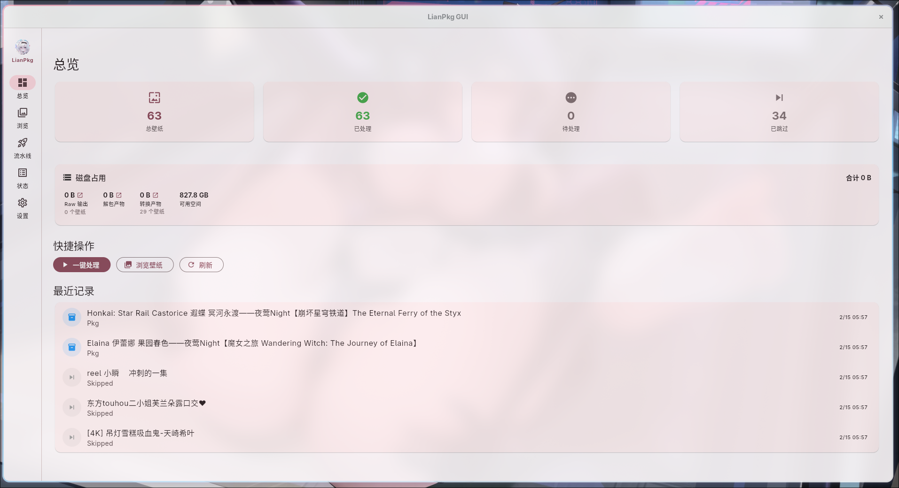
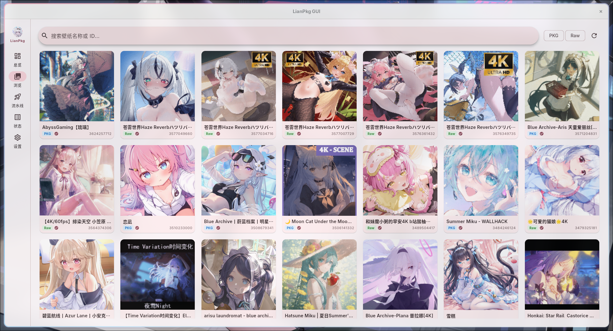
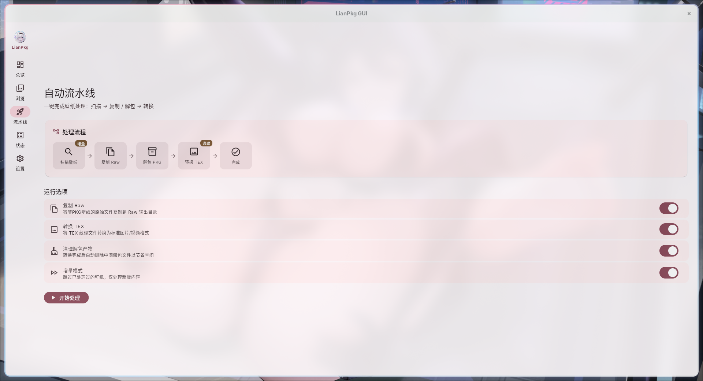
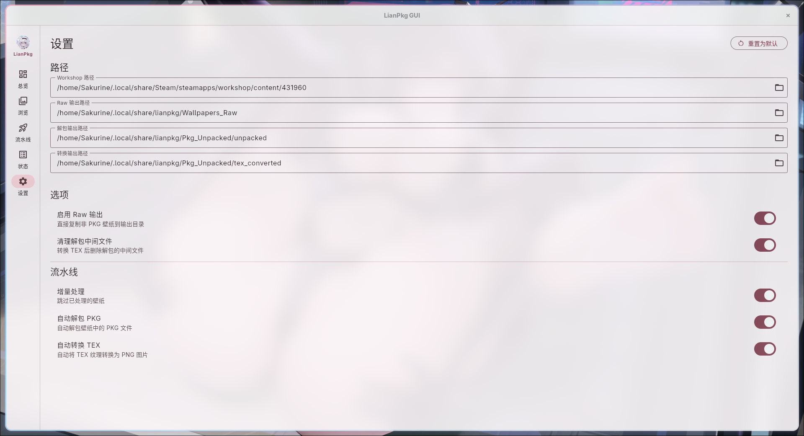

<div align="center">


# LianPkg ✨

Wallpaper Engine 壁纸资源处理工具 — CLI + GUI

提取壁纸文件、解包 `.pkg`、转换 `.tex` 纹理为常见图像/视频格式，支持 Linux 与 Windows。

</div>

### 特性

- **图形界面** — Flutter GUI，可视化操作全部功能
- **全自动流水线** — 一条命令 / 一键按钮完成 扫描 → 解包 → 转换
- **多线程 TEX 转换** — 基于 rayon 并行处理，充分利用多核 CPU
- **增量处理** — 自动跳过已处理的壁纸，只处理新增内容
- **多格式支持** — 支持 TEX v1-v4、图片纹理（PNG）、视频纹理（MP4）
- **自动探测** — 自动扫描所有 Steam Library 定位壁纸目录（支持多磁盘）
- **跨平台** — Linux / Windows 双平台支持

---

## 截图预览 📷

| 总览仪表盘 | 壁纸浏览 |
|:---:|:---:|
|  |  |
| **自动流水线** | **设置** |
|  |  |

---

## 使用前须知 ⚠️

> 推荐先执行一次 `lianpkg auto --dry-run` 核对实际路径

LianPkg 的工作对象是 Steam Workshop 中的 Wallpaper Engine 壁纸资源，默认处理目录为：

- **Linux**: `~/.local/share/Steam/steamapps/workshop/content/431960`
- **Windows**: 自动扫描 `libraryfolders.vdf` 定位

程序会自动扫描 Steam 库配置文件（包括 Flatpak / Snap 安装），即使你的 Wallpaper Engine 安装在非默认的 Steam 库，程序也能自动定位到正确的壁纸路径。

**前提条件**：
- 已安装并运行过 Steam 官方的 Wallpaper Engine
- 已通过 Steam 订阅并下载过壁纸

---

## 安装 📦

### 下载预编译版本

在 [Releases](https://github.com/Yueosa/lianpkg/releases) 页面下载对应平台的文件：

| 产物 | Linux | Windows |
|---|---|---|
| CLI 命令行 | `lianpkg_*_linux_x86_64` (1.3M) | `lianpkg_*_windows_x86_64.exe` (1.5M) |
| GUI 图形界面 | `lianpkg-gui_*_linux_x86_64.tar.gz` (~19M) | `lianpkg-gui_*_windows_x86_64.zip` (~12M) |
| FFI 共享库 | `liblianpkg_*_linux_x86_64.so` (1.2M) | `lianpkg_*_windows_x86_64.dll` (4.6M) |

> GUI 通过 FFI 动态加载 Rust 共享库，共享库已打包在 GUI 发行包内（`lib/` 目录），无需单独下载

#### Linux GUI 安装说明

`tar.gz` 压缩包解压后是一个完整的程序目录，结构如下：

```
lianpkg-gui/                  ← 解压后的根目录
├── lianpkg-gui               ← 可执行文件（启动入口）
├── lib/
│   ├── libflutter_linux_gtk.so  ← Flutter 引擎
│   ├── libapp.so               ← 应用逻辑
│   └── liblianpkg.so           ← Rust FFI 共享库
└── data/
    ├── icudtl.dat              ← 国际化数据
    └── flutter_assets/         ← 字体、着色器、图标等资源
```

```bash
# 解压并运行
mkdir -p ~/Apps/lianpkg-gui
tar -xzf lianpkg-gui_*_linux_x86_64.tar.gz -C ~/Apps/lianpkg-gui
~/Apps/lianpkg-gui/lianpkg-gui
```

> ❗ 不要单独移动 `lianpkg-gui` 可执行文件，它必须与 `lib/` 和 `data/` 目录保持相对位置才能运行

### Arch Linux (AUR)

```bash
# CLI
yay -S lianpkg-bin
# GUI
yay -S lianpkg-gui-bin
```

### 从源码编译

```bash
git clone https://github.com/Yueosa/lianpkg.git
cd lianpkg

# CLI
cargo build --release
# 二进制文件位于 target/release/lianpkg

# GUI（需要 Flutter SDK）
cd gui && flutter build linux --release
# 产物位于 gui/build/linux/x64/release/bundle/
```

---

## 配置 🛠️

首次运行时，LianPkg 会生成默认配置文件：

| 平台 | 配置路径 |
|------|------|
| Linux | `~/.config/lianpkg/config.toml` |
| Windows | `%APPDATA%\lianpkg\config.toml` |

默认输出路径（Linux）：

| 用途 | 路径 |
|------|------|
| 原始壁纸复制 | `~/.local/share/lianpkg/Wallpapers_Raw` |
| PKG 解包中间产物 | `~/.local/share/lianpkg/Pkg_Unpacked/unpacked` |
| TEX 转换最终产物 | `~/.local/share/lianpkg/Pkg_Unpacked/tex_converted` |

配置优先级：**命令行参数** > `config.toml` > **默认值**

---

## 快速开始 🚀

### GUI 图形界面

启动 `lianpkg-gui` 后即可使用，提供：

- **总览仪表盘** — 壁纸统计、磁盘占用、最近记录
- **壁纸浏览** — 缩略图网格 + 搜索筛选 + 单壁纸操作
- **自动流水线** — 可视化流程图 + 开关配置 + 实时进度
- **配置管理** — 路径、开关、流水线选项全部可视化设置

GUI 通过 FFI 调用同一个 Rust 核心，与 CLI 共享全部处理能力。

### CLI 命令行

```bash
# 一键处理所有壁纸（推荐，默认增量处理）
lianpkg auto

# 先预览将执行的操作
lianpkg auto --dry-run

# 强制全量处理（忽略之前的处理记录）
lianpkg auto --no-incremental
```

---

## 命令参考 📖

> 此部分面向高级用户

```
lianpkg [OPTIONS] <COMMAND>
```

### 全局选项

| 选项 | 说明 |
|------|------|
| `-c, --config <FILE>` | 指定配置文件路径 |
| `-d, --debug` | 启用调试日志 |
| `-h, --help` | 显示帮助信息 |
| `-V, --version` | 显示版本信息 |

### 命令列表

| 命令 | 别名 | 说明 |
|------|------|------|
| `wallpaper` | `w`, `scan` | 壁纸扫描与复制 |
| `pkg` | `p` | PKG 文件解包 |
| `tex` | `t` | TEX 文件转换 |
| `auto` | `a` | 全自动流水线 |
| `show` | | 查看单个壁纸详情 |
| `config` | `c` | 配置管理 |
| `status` | `s` | 状态查看 |

---

### `wallpaper` — 壁纸扫描与复制 🖼️

扫描 Steam Workshop 目录，将壁纸分类提取。

```bash
lianpkg wallpaper [OPTIONS] [PATH]
```

**参数**：
- `[PATH]` — 壁纸源目录（默认从配置读取）

**选项**：
| 短格式 | 长格式 | 说明 |
|------|------|------|
| `-r` | `--raw-out <PATH>` | 原始壁纸输出路径 |
| | `--no-raw` | 跳过原始壁纸复制（只提取 PKG） |
| `-i` | `--ids <IDS>` | 只处理指定壁纸 ID（逗号分隔） |
| `-p` | `--preview` | 预览模式（列出壁纸，不执行复制） |
| `-v` | `--verbose` | 详细预览（显示完整元数据） |

**示例**：
```bash
# 预览所有壁纸
lianpkg wallpaper --preview

# 只提取特定壁纸
lianpkg wallpaper --ids 123456789,987654321
# 或使用短格式
lianpkg w -i 123456789,987654321

# 自定义输出路径
lianpkg wallpaper -r ~/wallpapers/raw
```

---

### `pkg` — PKG 文件解包 📦

将 `.pkg` 文件解包为原始资源（纹理、JSON 等）。

```bash
lianpkg pkg [OPTIONS] [PATH]
```

**参数**：
- `[PATH]` — 输入路径（.pkg 文件或包含 .pkg 的目录）

**选项**：
| 短格式 | 长格式 | 说明 |
|------|------|------|
| `-o` | `--output <PATH>` | 解包输出路径 |
| `-p` | `--preview` | 预览模式（显示 PKG 内容，不解包） |
| `-v` | `--verbose` | 详细预览 |

**示例**：
```bash
# 解包单个 PKG 文件
lianpkg pkg ./scene.pkg -o ./output

# 预览 PKG 内容
lianpkg pkg ./scene.pkg -p -v

# 批量解包目录
lianpkg p ~/wallpapers/pkg_temp
```

---

### `tex` — TEX 文件转换 🧩

将 `.tex` 纹理文件转换为 PNG/图像格式。

```bash
lianpkg tex [OPTIONS] [PATH]
```

**参数**：
- `[PATH]` — 输入路径（.tex 文件或包含 .tex 的目录）

**选项**：
| 短格式 | 长格式 | 说明 |
|------|------|------|
| `-o` | `--output <PATH>` | 转换输出路径（默认从 config.toml 读取） |
| `-p` | `--preview` | 预览模式（显示 TEX 格式信息，不转换） |
| `-v` | `--verbose` | 详细预览 |

**示例**：
```bash
# 转换单个 TEX 文件
lianpkg tex ./texture.tex

# 预览 TEX 格式信息
lianpkg t ./texture.tex -p -v

# 批量转换目录
lianpkg tex ~/wallpapers/unpacked -o ~/wallpapers/images
```

---

### `auto` — 全自动流水线 🤖

按顺序执行：**提取壁纸** → **解包 PKG** → **转换 TEX**

```bash
lianpkg auto [OPTIONS]
```

**路径选项**：
| 短格式 | 长格式 | 说明 |
|------|------|------|
| `-q` | `--quiet` | 静默模式（只输出结果） |
| `-s` | `--search <PATH>` | 壁纸源目录 |
| `-r` | `--raw-out <PATH>` | 原始壁纸输出目录 |
| `-u` | `--unpacked-out <PATH>` | 解包输出目录 |
| `-o` | `--tex-out <PATH>` | TEX 转换输出目录 |

**行为选项**：
| 短格式 | 长格式 | 说明 |
|------|------|------|
| | `--no-raw` | 跳过原始壁纸提取 |
| | `--no-tex` | 跳过 TEX 转换 |
| | `--no-clean-unpacked` | 保留解包中间产物 |
| | `--no-incremental` | 禁用增量处理（重新处理所有壁纸） |
| `-i` | `--ids <IDS>` | 只处理指定壁纸 ID（逗号分隔） |
| `-n` | `--dry-run` | 仅显示计划，不执行 |

**示例**：
```bash
# 一键处理所有壁纸
lianpkg auto
# 或使用短命令
lianpkg a

# 预览执行计划
lianpkg auto -n

# 只处理特定壁纸
lianpkg a -i 123456789

# 全量重新处理
lianpkg auto --no-incremental

# 保留中间文件用于调试
lianpkg auto --no-clean-unpacked

# 自定义输出路径
lianpkg auto -s ~/workshop -o ~/output/converted
```

---

### `show` — 查看壁纸详情 🔍

按 ID 快速查看单个壁纸的信息。

```bash
lianpkg show <ID> [OPTIONS]
```

**参数**：
- `<ID>` — 壁纸 ID（必填）

**选项**：
| 短格式 | 长格式 | 说明 |
|------|------|------|
| `-v` | `--verbose` | 详细模式（显示完整元数据 + PKG 内容） |

**示例**：
```bash
# 查看壁纸基本信息
lianpkg show 123456789

# 查看详细信息（含 PKG 文件内容）
lianpkg show 123456789 -v
```

---

### `config` — 配置管理 ⚙️

管理 LianPkg 配置文件。

```bash
lianpkg config <SUBCOMMAND>
```

**子命令**：
| 命令 | 说明 |
|------|------|
| `show` | 显示当前完整配置 |
| `path` | 显示配置文件路径 |
| `get <KEY>` | 获取指定配置项 |
| `set <KEY> <VALUE>` | 设置配置项 |
| `reset [-y]` | 重置为默认配置 |
| `edit` | 用 $EDITOR 打开配置文件 |

**示例**：
```bash
# 查看当前配置
lianpkg config show

# 修改配置项
lianpkg config set wallpaper.workshop_path "/custom/path"

# 编辑配置文件
lianpkg config edit
```

---

### `status` — 状态查看 📊

查看处理状态和统计信息。

```bash
lianpkg status [OPTIONS]
```

**选项**：
| 选项 | 说明 |
|------|------|
| `--full` | 显示完整统计 |
| `--list` | 列出所有已处理的壁纸 |
| `--clear` | 清除状态记录 |
| `-y, --yes` | 跳过确认（与 --clear 配合） |

**示例**：
```bash
# 查看处理状态
lianpkg status

# 列出已处理壁纸
lianpkg status --list

# 清除状态（重新处理）
lianpkg status --clear -y
```

---

## 磁盘空间 💾

GUI 总览页实时显示各输出目录的实际占用大小（Raw 输出 / 解包产物 / 转换产物）。

CLI `auto` 模式会在执行前自动：

1. **预估磁盘占用** — 根据待处理 PKG 文件大小估算峰值空间需求
2. **检查剩余空间** — 空间不足时警告并等待确认
3. **错误保护** — 发生错误时自动清理临时文件

---

## 文档 📚

| 文档 | 说明 |
|------|------|
| [技术文档：文件格式与算法](./docs/technical_details.md) | PKG/TEX 格式深度解析、流水线流程、架构设计 |
| [FFI 集成文档](./docs/ffi.md) | 共享库 (.so/.dll) 的通信协议、Action 参考、多语言示例 |
| [GUI 文档](./docs/gui.md) | Flutter 图形界面架构、页面说明、构建与分发 |
| [API 层文档](./docs/core/api.md) | Rust 原生 API 接口、类型定义、调用示例 |
| [Core 模块文档](./docs/core/) | 各底层模块详细说明（cfg / paper / path / pkg / tex / error） |

---

## 免责声明 📄

本工具仅供学习交流和个人备份使用。

1. **版权归属**: 本工具提取的所有资源版权归原作者或 Wallpaper Engine 所有。请勿用于商业用途。
2. **使用责任**: 用户应遵守相关法律法规，开发者不承担任何使用后果责任。
3. **非官方工具**: 本项目与 Wallpaper Engine 或 Valve (Steam) 无任何官方关联。

---

## 致谢 🙏

本项目算法灵感来源于对现有工具的研究：

- **[RePKG](https://github.com/notscuffed/repkg)** by notscuffed (MIT License) — PKG 文件结构参考
- **[we](https://github.com/redpfire/we)** by redpfire (GPL-3.0 License) — 文件格式分析参考

LianPkg 是完全独立的 Rust 重写版本，未复制任何源代码。

---

## License

GPL-3.0 License
